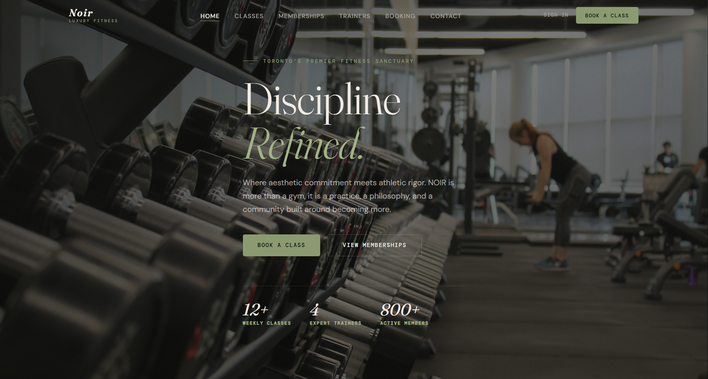
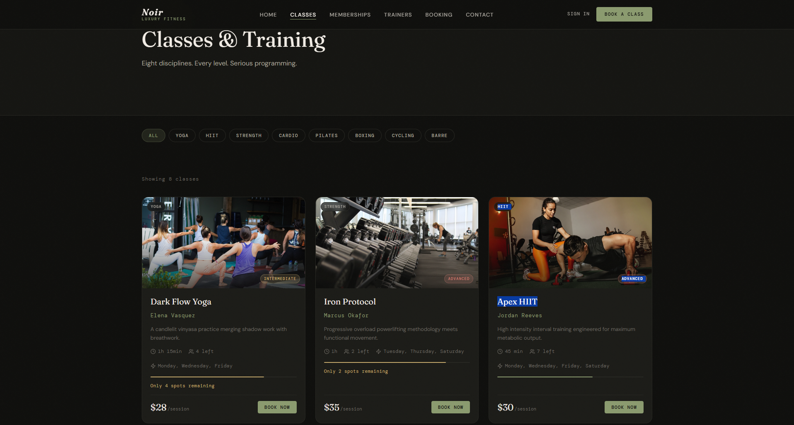
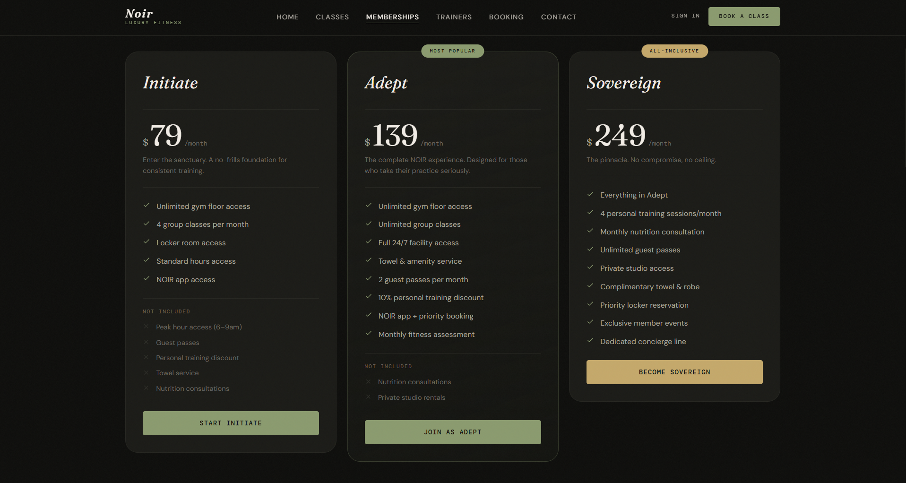
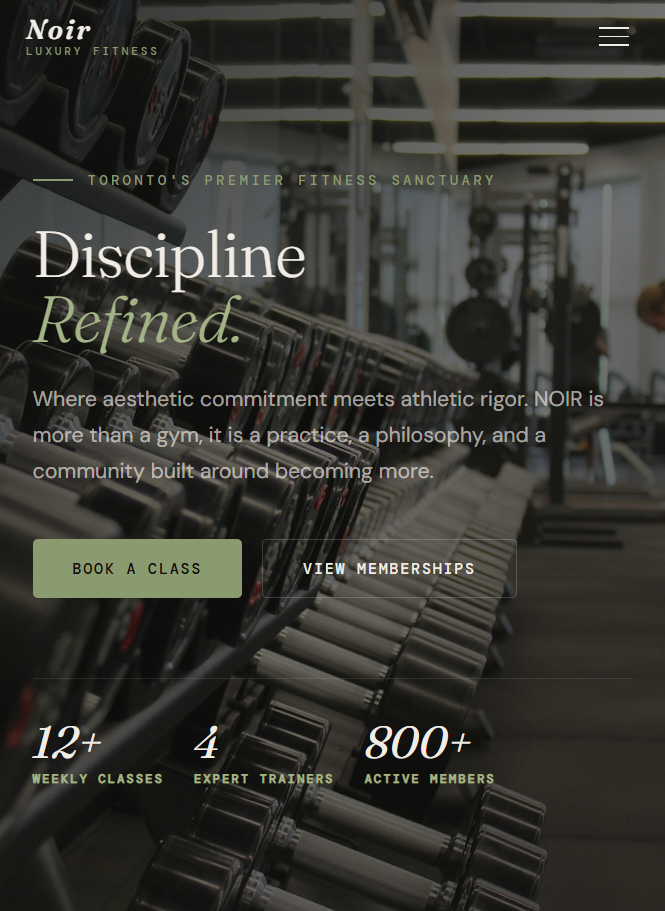
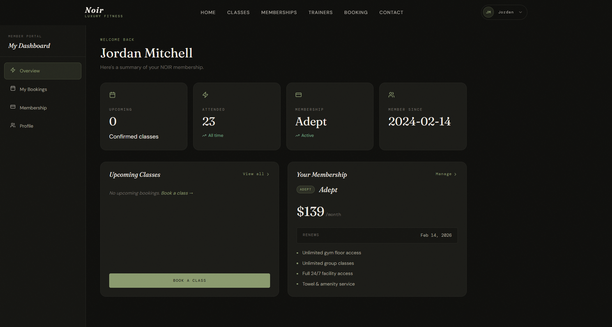
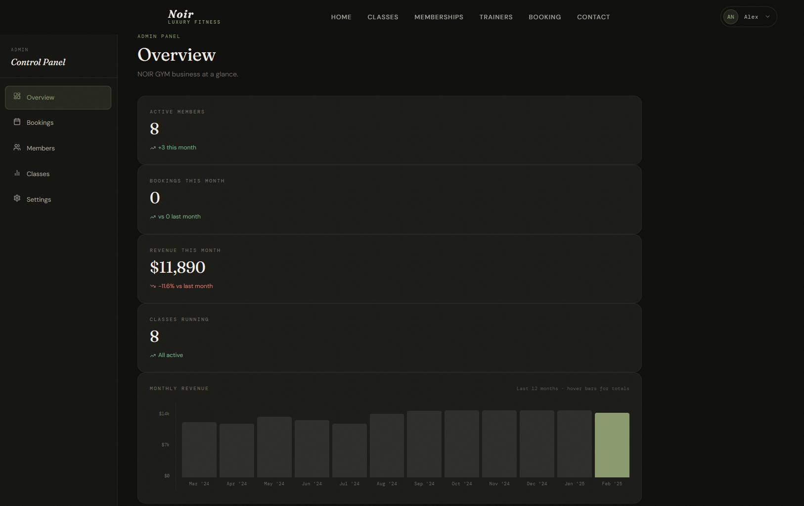
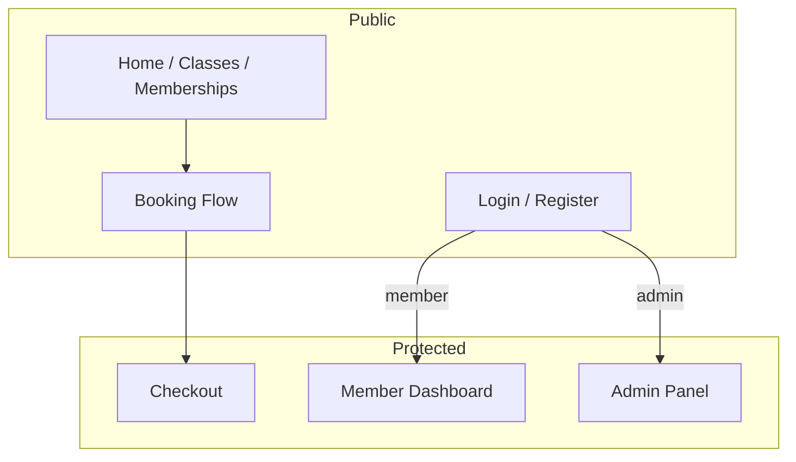

<div align="center">

# NOIR GYM

### Luxury fitness platform — booking, memberships, and dual dashboards

*Discipline refined. A full-stack gym experience built for portfolio and production-style UX.*

<br />

[](https://noir-gym-platform.vercel.app/)
[](https://react.dev/)
[](https://www.typescriptlang.org/)
[](https://vitejs.dev/)
[](https://reactrouter.com/)
[](https://github.com/css-modules/css-modules)
[](https://noir-gym-platform.vercel.app/)

<br />

**[→ Explore live demo](https://noir-gym-platform.vercel.app/)** · **[→ Admin panel](https://noir-gym-platform.vercel.app/admin)** · **[→ Book a class](https://noir-gym-platform.vercel.app/booking)**

</div>

<br />



<br />

---

## Why NOIR GYM?

Most gym sites stop at marketing pages. **NOIR GYM** is a complete product surface: public discovery, multi-step booking, member portal, checkout, and an admin control panel — all with a cohesive luxury dark UI, role-based routing, and realistic mock data.

| Capability | NOIR GYM | Typical gym landing page |
|---|:---:|:---:|
| Multi-step class booking + calendar | ✅ | ❌ |
| Membership tiers + comparison | ✅ | ⚠️ Static only |
| Member dashboard (bookings, tier, profile) | ✅ | ❌ |
| Admin panel (members, bookings, revenue) | ✅ | ❌ |
| Auth + protected routes (user / admin) | ✅ | ❌ |
| Responsive mobile layout | ✅ | ⚠️ |

---

## Live demo

| Role | Email | Password | Where to go |
|---|---|---|---|
| **Member** | `member@noirgym.com` | `member123` | [Dashboard](https://noir-gym-platform.vercel.app/dashboard) |
| **Admin** | `admin@noirgym.com` | `admin123` | [Admin overview](https://noir-gym-platform.vercel.app/admin) |

Use **Sign In** on the site, or the quick-fill hints on the login page. No backend required — sessions run on client-side mock auth.

---

## Preview

### Public experience

<table>
<tr>
<td width="50%">

**Class catalog** — category filters, difficulty badges, live capacity



</td>
<td width="50%">

**Memberships** — three tiers, feature lists, comparison-ready layout



</td>
</tr>
<tr>
<td colspan="2" align="center">

**Mobile** — responsive hero and navigation



</td>
</tr>
</table>

### Member & admin portals

<table>
<tr>
<td width="50%">

**Member dashboard** — stats, upcoming classes, membership card



</td>
<td width="50%">

**Admin overview** — KPIs, revenue chart, recent bookings table



</td>
</tr>
</table>

---

## Features

**Marketing & discovery**
- Hero, features, class preview, testimonials, and CTAs on `/`
- Full class schedule with category filtering on `/classes`
- Trainer profiles on `/trainers`
- Tiered memberships with FAQ on `/memberships`
- Contact form with success state on `/contact`

**Booking & commerce**
- 4-step booking flow: class → date/time (custom calendar) → details → confirm
- Protected checkout flow for authenticated users

**Authentication**
- Login & register with role-aware redirects
- `ProtectedRoute` guards for user-only and admin-only areas

**Member portal** (`/dashboard/*`)
- Overview with upcoming bookings and membership summary
- Booking history, membership management, profile settings

**Admin control panel** (`/admin/*`)
- Overview with stat cards, 12-month revenue chart, recent bookings
- Bookings, members, classes, and settings management views

---

## Tech stack

| Layer | Choice |
|---|---|
| UI | React 18 + TypeScript |
| Build | Vite 5 |
| Routing | React Router v6 |
| Styling | CSS Modules (design tokens in `globals.css`) |
| Icons | Lucide React |
| Typography | Fraunces · DM Sans · DM Mono |
| Hosting | Vercel |
| Data | Client-side mock auth & fixtures (no API) |

---

## Quick start

```bash
npm install
npm run dev
```

Open [http://localhost:5173](http://localhost:5173)

| Command | Description |
|---|---|
| `npm run dev` | Development server |
| `npm run build` | Type-check + production build |
| `npm run preview` | Preview production build locally |

---

## Routes

| Route | Access | Description |
|---|---|---|
| `/` | Public | Home |
| `/classes` | Public | Class catalog + filters |
| `/memberships` | Public | Pricing tiers |
| `/trainers` | Public | Trainer profiles |
| `/booking` | Public | 4-step booking flow |
| `/contact` | Public | Contact form |
| `/login` · `/register` | Public | Authentication |
| `/checkout` | Auth | Checkout |
| `/dashboard` | Member | Member overview |
| `/dashboard/bookings` | Member | Booking history |
| `/dashboard/membership` | Member | Tier & renewal |
| `/dashboard/profile` | Member | Profile settings |
| `/admin` | Admin | KPI overview + revenue chart |
| `/admin/bookings` | Admin | Booking management |
| `/admin/members` | Admin | Member directory |
| `/admin/classes` | Admin | Class management |
| `/admin/settings` | Admin | Gym settings |

---

## Architecture



```
src/
├── pages/              # Route-level views + CSS Modules
│   ├── dashboard/      # Member portal
│   └── admin/          # Admin control panel
├── components/
│   ├── layout/         # Navbar, Footer, DashboardLayout
│   ├── admin/          # StatCard, charts, tables, modals
│   ├── auth/           # ProtectedRoute
│   └── ui/             # Cards, toasts, shared UI
├── context/            # Auth + toast providers
├── data/               # Classes, memberships, mock users & bookings
├── types/              # TypeScript interfaces
├── hooks/              # useScrolled
├── utils/              # cn, formatPrice, calendar helpers
└── styles/             # globals.css design tokens
```

---

## Design system

| Token | Value | Usage |
|---|---|---|
| Base | `#0d0d0b` | Background |
| Accent | `#8a9a6e` | CTAs, active states, charts |
| Gold | `#c4a86a` | Premium highlights |
| Text | `#f2ede6` | Primary copy |
| Display | Fraunces | Headlines & numbers |
| Body | DM Sans | UI & paragraphs |
| Mono | DM Mono | Labels, badges, tables |

---

<div align="center">

Built as a portfolio-grade luxury fitness platform · **NOIR GYM**

[Live demo](https://noir-gym-platform.vercel.app/) · [Admin](https://noir-gym-platform.vercel.app/admin) · [Booking](https://noir-gym-platform.vercel.app/booking)

</div>
